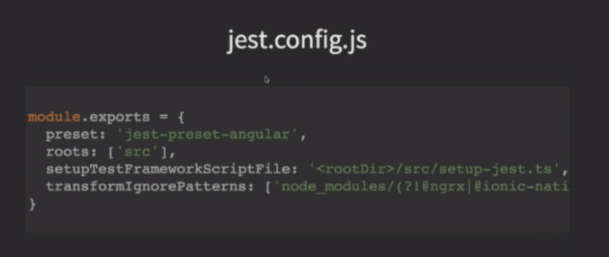

# ionic-ngrx

> video: NgRx Mobile with Ionic - Jesse Sanders
> https://www.youtube.com/watch?v=KgUuiI_HVII

## The advantage of ngrx upon services

* we can go ahead and dicth putting a branch of date in to services . Using services is greate because it's a singleton and I can pass it around and use it , but the problem is that we just store that as raw data and when it gets updated when it's up to me to figure out how I get at each one of those components . Ngrx helps me solve that . 

* Another things that ngrx is great for is with the codova plugins , so you think about a cordova plugin that they're asynchronous and they're going return data and they're going to return an error and I  am going gave a picture back 

## the mobile challenges

* Slow/no network
* Complexity : we have complexity to get data together and when it's coming  in disparate times (组织数据比较复杂， 尤其在数据是分次过来的时候)

## the NGRX MOBILE(solve above problems)

* simplify our application

* container / Presentation 

* Easier to handle data as it shows up

## IMPLEMENTING NGRX

* Create ionic app as usual

* Integrate angular-cli

* Ngrx schematics

* Use path aliases

1. Create our app


```bash
ionic start myapp

```

2. ANGULAR CLI

* copy an existing .angular-cli.json file and rename the project

3. ADD CLI AND NGRX

```bash
# install angular-cli
npm i @angular/cli --save-dev

# install ngrx
# ngrx schematics: will save you alit of time , so instead of hveing to generate out model, actions, reducer, effects yourself, it's going to give you a baseline to work with  
npm i @ngrx/{store,entity,effects,schematics}

# install store freeze(冻结)
# with ngrx-devtools we can take a look at how our state's changing . If we're doing ngrx, it's a really a mandate(正式命令) you should have the dev tools and you need to see how your state changing and you need to make sure you states not getting mutated (突变)
# store-freeze is a meta-reducer that prevents state from being mutated, it'll make sure that it you do mutate it , instead of it just kind of silently failing on you it'll go ahead and throw an error and let you know that you mutated state and you need to probably fix you reducer 
npm i @ngrx/store-devtools ngrx-store-freeze --save-dev

```

> ngrx-store-freeze is a meta-reducer that prevents state from being mutated

* Recursively freezes the current state, the dispatched action payload if provided and the new state.
* When mutation occurs, an exception will be thrown.
* Should be used only in development to ensure that the state remains immutable.


4. CONFIGURE SCHEMATICS

```bash

# tell the CLI about the schematics , so I want to use 'ng set (this is part of the CLI, and this alows me to change one of the settings)' to change my defaults for the setting . we want to change my defaults for the schematics collection to point to ngrx schematics . So that'll support angular schematics plus it'll support our ngrx schematics   

ng set defaults.schematics.collection=@ngrx/schematics

```

5. PATH ALIASES

> Path aliases really help me clean up my code . It makes alot easier I can start to move components around if I want to move it outside of the you know from one folder to another folder 

* long ../../../ paths are impossible
* path aliases simplify our code
* Easy to move and refactor
* tsconfig.json

> what we do this is in to tsconfig.json 

```js
// in tsconfig.json
// Path mapping:  https://www.typescriptlang.org/docs/handbook/module-resolution.html 
"paths" : {
    "@state/*" : [ "app/state/*" ],
    "@core/*" : [ "app/core/*" ],
    "@app/*" : [ "app/" ],
    "@assets/*" : [ "assets/*" ],
    "@env" : [ "environments/environments" ],
    "@pages/*" : [ "pages/*" ],
    "@theme/*" : [ "theme/*" ]

}

```

6. PATHs STILL DON"T WORK in ionic project

> I've got paths configured but acturally path still don't work. So what we just showed above is how you would do in a standard angular CLI project , but the problem is how webpack builds for ionic is a little different . So we nedd to tell webpack what to do , so webpack is missing a little step here . We want to create a config folder in our route and add a webpack.config.js file . What's this going to do is to help resolve 


7. JEST

```bash
# install jest
npm install jest-presets-angular --save-dev

```




